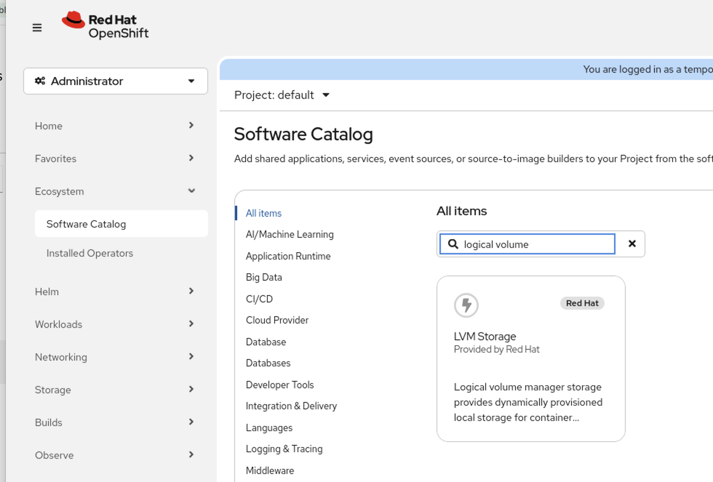
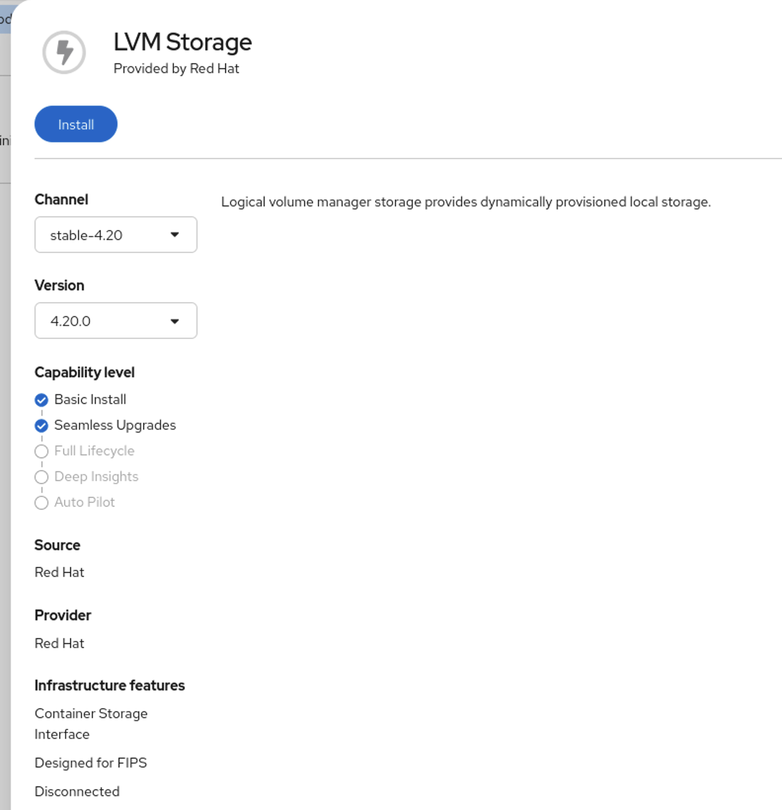
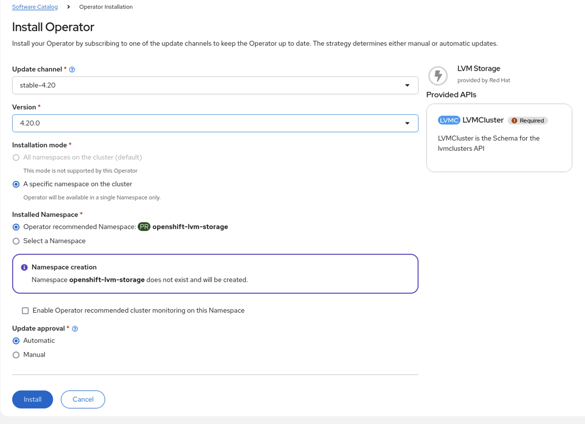
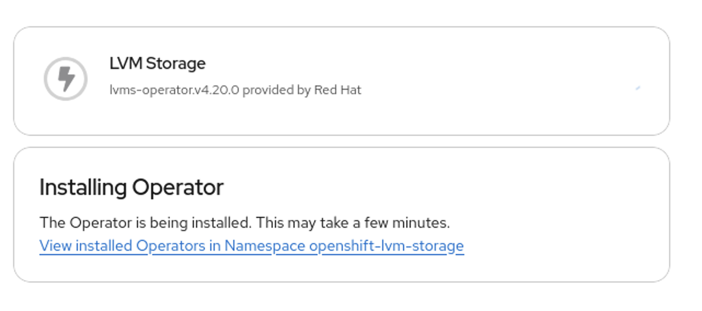
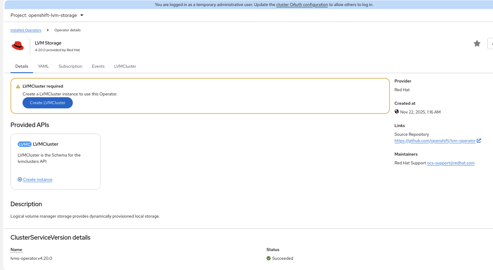
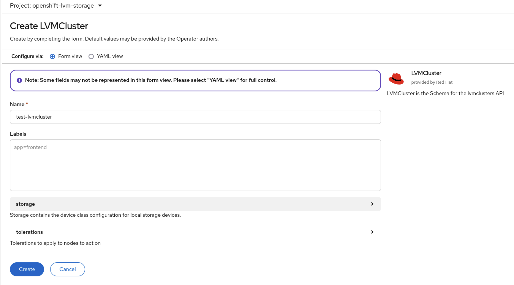
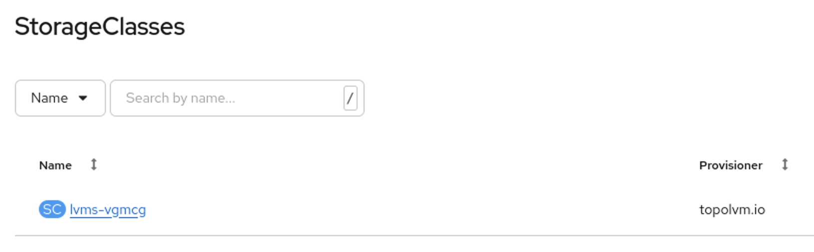

# Enable Multicluster observability - using the console

Since observability requires S3 service available to the ACM cluster, any kind of S3 service must be available or must be made available.

One easy way to provide this for PoC is to

- provide an extra disk/partition for local storage
- provide PVs through Logical Volume Manager for Openshift
- provide S3 through standalone MCG (using the LVM storage class as backing store)

## 0. Provide local storage trough extra device

Add a local disk to the node. Ideally, ensure that it's flash storage to avoid HDD based latency impact.

Install LVM:
Select LVM from OperatorHub and install it into the default namespace. Create an initial LVMCluster.













A storage configuration should be selected matching the nodes to use and the desired configuration. Please make sure not to choose this LVMcluster as the default storage class unless you really want it.


The thin pool configuration should be selected but the defaults can be used as those are.


Be aware that there might be a WebHook Admission warning be thrown if you didn't select it as default storage class and there is no other storage class set to be the default one. This can be ignored unless you need additional persistence storage - and one should understand that this needs to be corrected in the next step (without being listed here).

Wait for the cluster to become ready which should happen within a couple of seconds.


Check that there is a storage class for LVM available.


## 1. Install MCG standalone

If you use ARM at the time of writing, ODF is not available from the operatorhub for selection.

Workaround: Install ODF using the CLI

**Install the operator**

```
cat <<EOF | oc apply -f -
apiVersion: v1
kind: Namespace
metadata:
  labels:
    openshift.io/cluster-monitoring: "true"
  name: openshift-storage
spec: {}
EOF
```

**Create the operator group for the ODF operator**

```
cat <<EOF | oc apply -f -
apiVersion: operators.coreos.com/v1
kind: OperatorGroup
metadata:
  name: openshift-storage-operatorgroup
  namespace: openshift-storage
spec:
  targetNamespaces:
  - openshift-storage
EOF
```

**Subscribe the operator**

```
cat <<EOF | oc apply -f -
apiVersion: operators.coreos.com/v1alpha1
kind: Subscription
metadata:
  name: odf-operator
  namespace: openshift-storage
spec:
  channel: "fast-4.20"
  installPlanApproval: Automatic
  name: odf-operator
  source: redhat-operators
  sourceNamespace: openshift-marketplace
EOF
```

**Enable the console**
oc patch console.operator cluster -n openshift-storage --type json -p '[{"op": "add", "path": "/spec/plugins", "value": ["odf-console"]}]'

**Create the cluster**

```
apiVersion: ocs.openshift.io/v1
kind: StorageCluster
metadata:
  name: ocs-storagecluster
  namespace: openshift-storage
spec:
  arbiter: {}
  encryption:
    kms: {}
  externalStorage: {}
  flexibleScaling: true
  resources: {}
  managedResources:
    cephBlockPools: {}
    cephConfig: {}
    cephFilesystems: {}
    cephObjectStoreUsers: {}
    cephObjectStores: {}
  multiCloudGateway:
    reconcileStrategy: manage   # <-- Default value is manage
  storageDeviceSets: {}
```

## 1. Create a S3 service - minimal is MCG standalone

##

## 1. Install the operator

##### ALL THIS IS C&P - OLD STUFF

From Operator Hub, select the ACM and install it:


Configure the operator to use namespace `open-cluster-management`. The subscription can be chosen as wanted - but during a PoC, best is to use manual approvals to avoid changes without knowing.


Once the operator is installed, an instance of the `MultiClusterHub` resource must be created. There are no configurables for it in normal virtualization. Only if one want's to use it in edge fleet management, the edge-manager-preview and siteconfig (optional) might be required. Hopwever, the most of the functionality is enabled by default. ([see](https://docs.redhat.com/en/documentation/red_hat_advanced_cluster_management_for_kubernetes/2.14/html-single/install/index#component-config))


Note: As ACM is supported also on infra nodes and ---> node selector

Wait for the MultiClusterHub instance to become Ready in the Phase:


## 2. Integrate the external cluster

Switch to "Fleet Management":


The local cluster is listed by default: (This could have been disabled in the multiclusterengine setup but is the default.)


Select "Create cluster" from the window's menu:


### Importing the cluster using the kubeconfig

Get the kubeconfig of your installed cluster.

Enter the name (in the case below, the DNS name) of the cluster, select the cluster set (TP in 2.14) and switch the import mode to `kubeconfig`. Then paste your kubeconfig file into the "Kubeconfig" field.


Automation: Note that this doesn't apply to imported clusters and thus can be ignored.


Check the provided details for the cluster import:


Then Create the cluster. Next, a green check sign will be shown in the right uppoer edge of the window saying that the settings were applied.
This doesn't mean that the cluster is imported but only that the configuration given had no basic mistakes.

Observe the main sreen for the status of the cluster import and wait for any changes:


Eventually, the status will become ready and all the cluster information of the imported cluster will be shown:


The newly imported cluster together with the initial local cluster will be shown in the overview list of clusters:


**DUMMIES**


