# Enable Multicluster observability - using the console

## 1. Install the operator

##### ALL THIS IS C&P - OLD STUFF

From Operator Hub, select the ACM and install it:

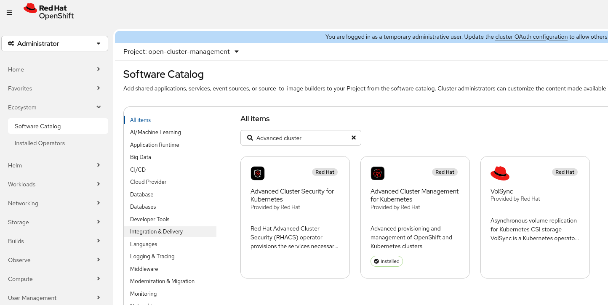

Configure the operator to use namespace `open-cluster-management`. The subscription can be chosen as wanted - but during a PoC, best is to use manual approvals to avoid changes without knowing.

Once the operator is installed, an instance of the `MultiClusterHub` resource must be created. There are no configurables for it in normal virtualization. Only if one want's to use it in edge fleet management, the edge-manager-preview and siteconfig (optional) might be required. Hopwever, the most of the functionality is enabled by default. ([see](https://docs.redhat.com/en/documentation/red_hat_advanced_cluster_management_for_kubernetes/2.14/html-single/install/index#component-config))
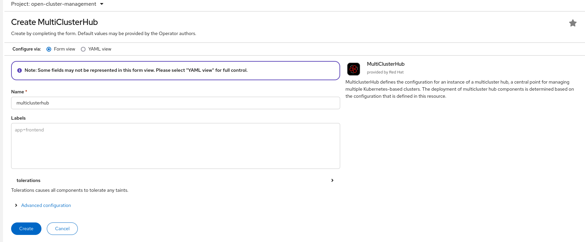

Note: As ACM is supported also on infra nodes and ---> node selector

Wait for the MultiClusterHub instance to become Ready in the Phase:
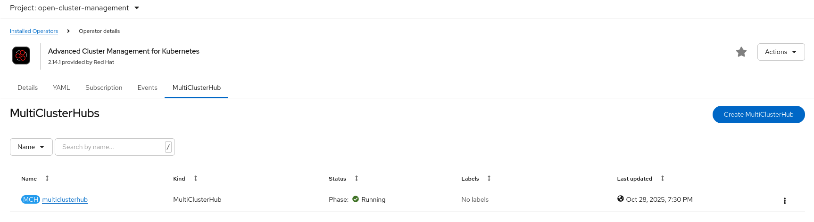

## 2. Integrate the external cluster

Switch to "Fleet Management":
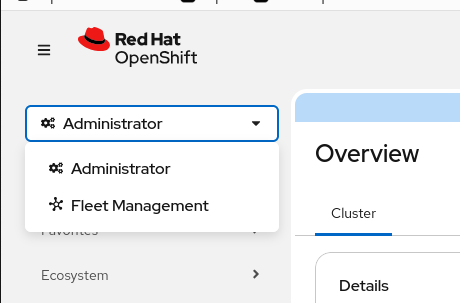

The local cluster is listed by default: (This could have been disabled in the multiclusterengine setup but is the default.)
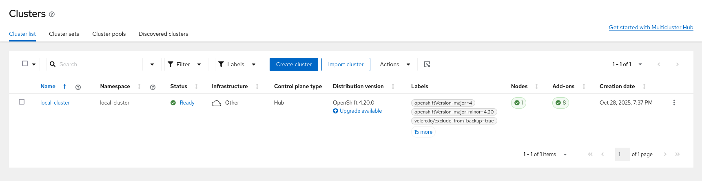

Select "Create cluster" from the window's menu:
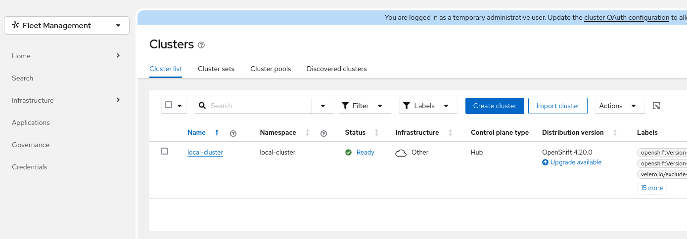

### Importing the cluster using the kubeconfig

Get the kubeconfig of your installed cluster.

Enter the name (in the case below, the DNS name) of the cluster, select the cluster set (TP in 2.14) and switch the import mode to `kubeconfig`. Then paste your kubeconfig file into the "Kubeconfig" field.
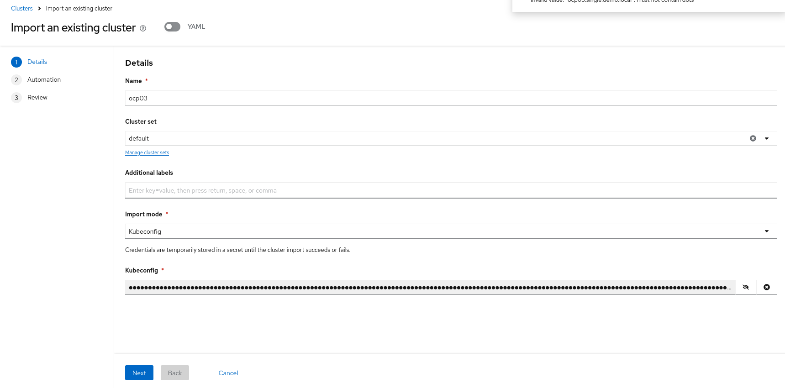

Automation: Note that this doesn't apply to imported clusters and thus can be ignored.
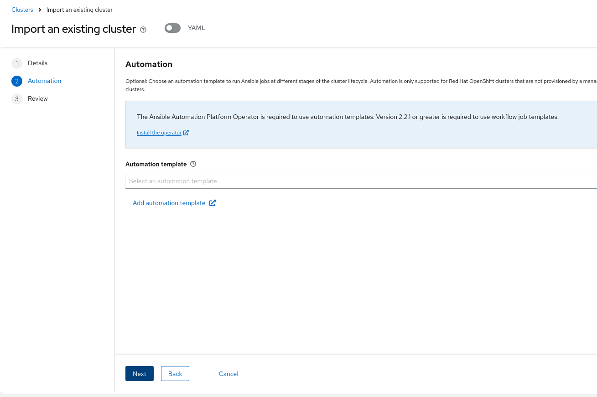

Check the provided details for the cluster import:
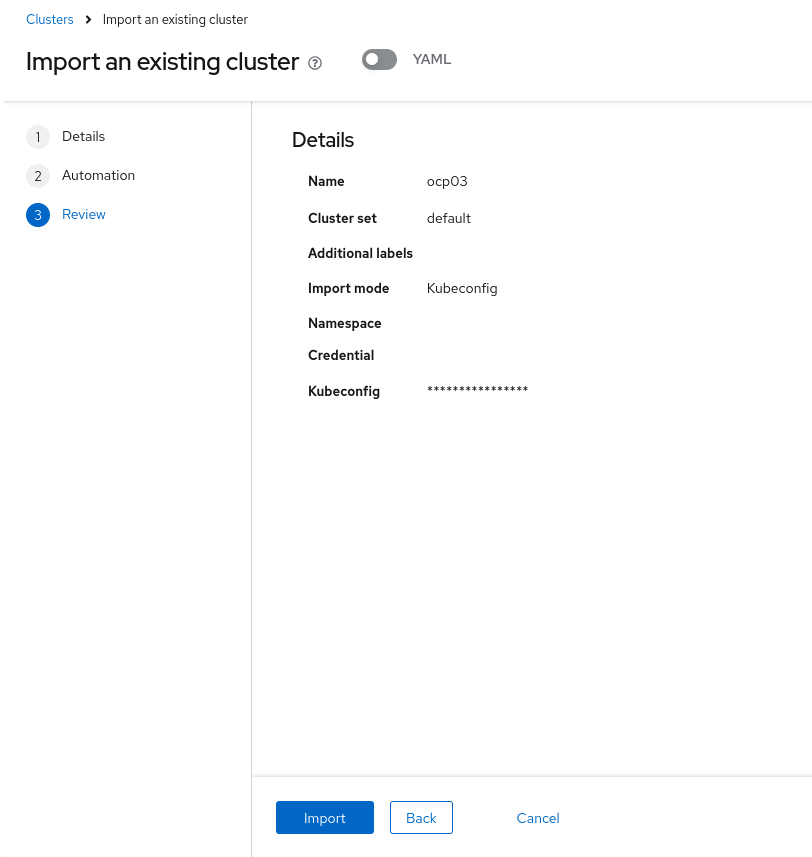

Then Create the cluster. Next, a green check sign will be shown in the right uppoer edge of the window saying that the settings were applied.
This doesn't mean that the cluster is imported but only that the configuration given had no basic mistakes.

Observe the main sreen for the status of the cluster import and wait for any changes:
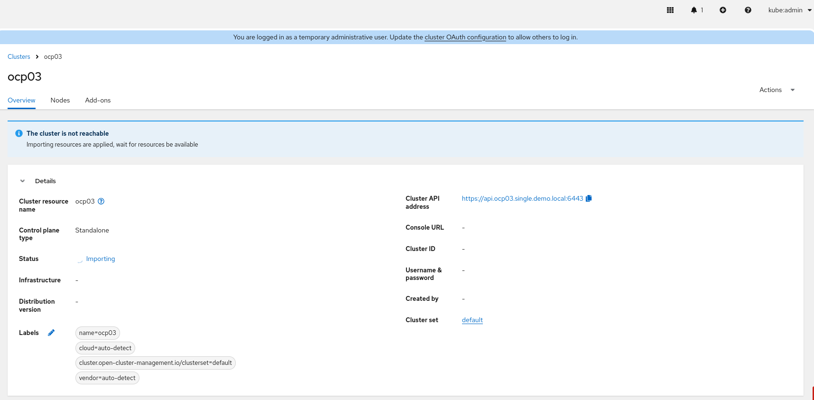

Eventually, the status will become ready and all the cluster information of the imported cluster will be shown:
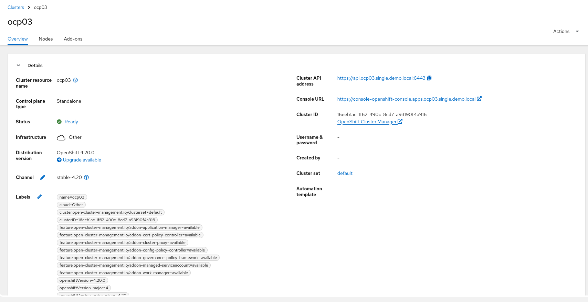

The newly imported cluster together with the initial local cluster will be shown in the overview list of clusters:
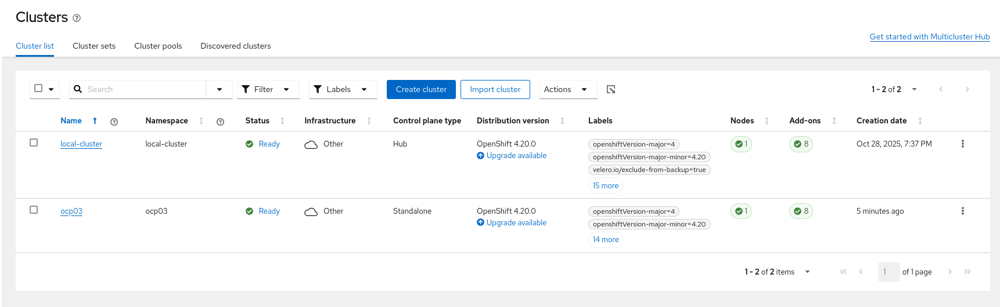

**DUMMIES**

