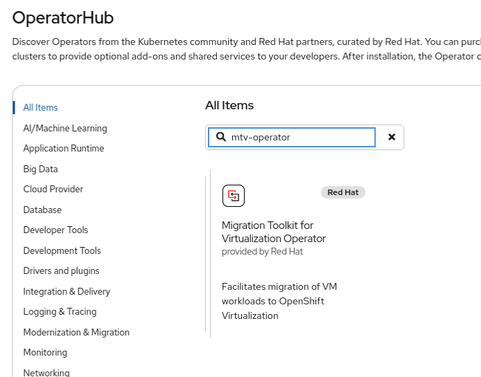
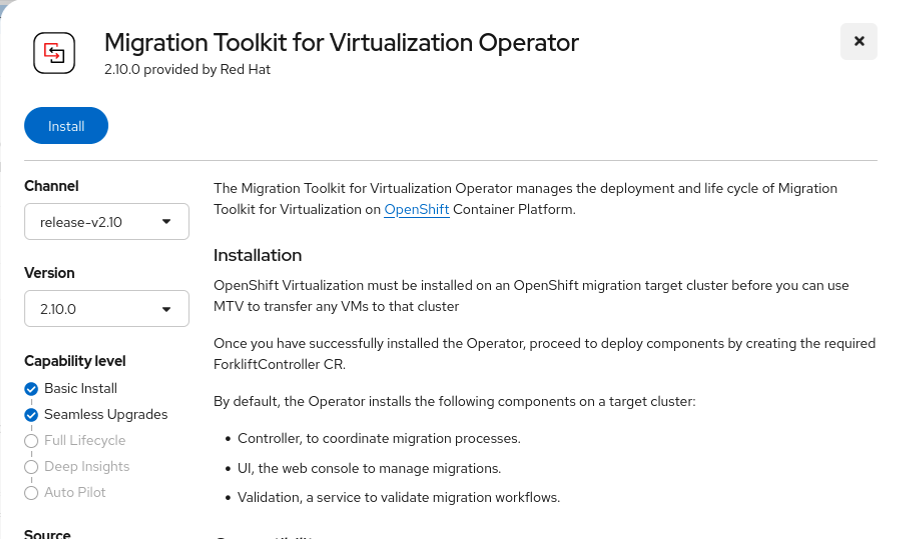
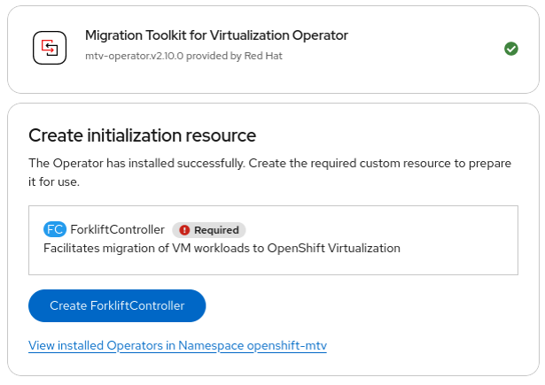
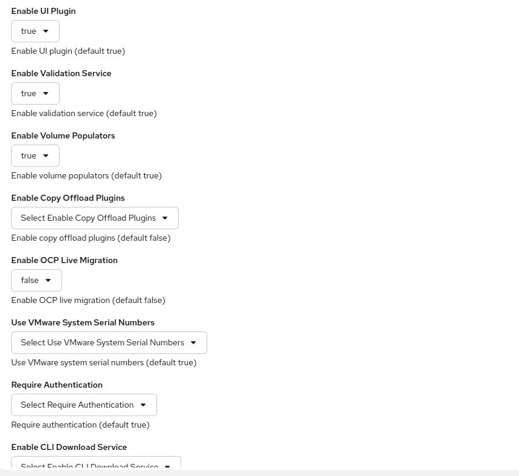
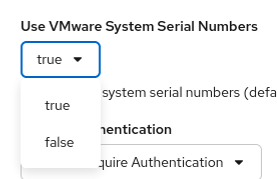
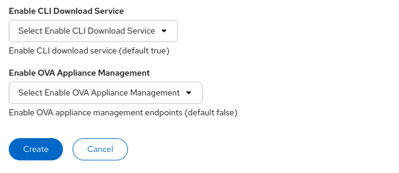
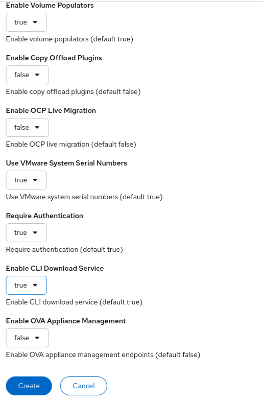
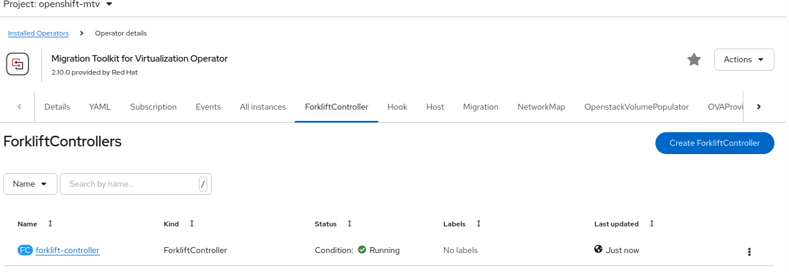
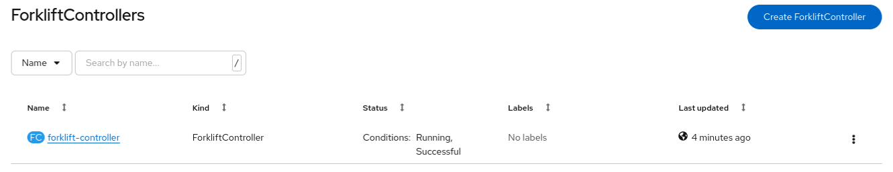
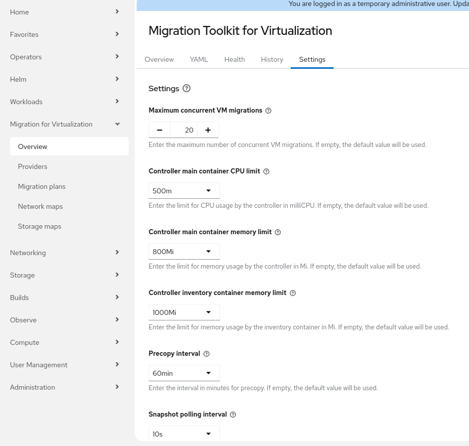

# Installation of the MTV using the console

## Installation of the operator








<br><br>**Directly click Create ForkliftController.** <br><br>




<br><br>Change the fields that have `Select` in the name: <br><br>




<br><br>Complete the rest of the entries as desired. An example configuration selection is shown: <br>


<br><br>Once ready, click `Create`.<br>

Check the defined ForkliftControllers and make sure, it's in state `Running`. <br>


<br><br>Check the actual installation:<br>

```
[root@clustername-jump vddk]# oc get -n openshift-mtv forkliftcontroller
NAME                  AGE
forklift-controller   2m43s
[root@clustername-jump vddk]# oc get -n openshift-mtv all
Warning: apps.openshift.io/v1 DeploymentConfig is deprecated in v4.14+, unavailable in v4.10000+
NAME                                                        READY   STATUS    RESTARTS   AGE
pod/forklift-api-685d695d88-qtfmb                           1/1     Running   0          119s
pod/forklift-cli-download-77b94c7cdd-7zvrx                  1/1     Running   0          75s
pod/forklift-controller-67c86bd6d-grzhg                     2/2     Running   0          2m32s
pod/forklift-operator-7f5bf8956-dr7ms                       1/1     Running   0          15m
pod/forklift-ova-proxy-7b4744f985-74dnd                     1/1     Running   0          2m21s
pod/forklift-ui-plugin-67c87db4b5-m6tjd                     1/1     Running   0          87s
pod/forklift-validation-7b6df46d78-bs5w4                    1/1     Running   0          93s
pod/forklift-volume-populator-controller-54db497c77-t5hvj   1/1     Running   0          2m3s

NAME                            TYPE        CLUSTER-IP       EXTERNAL-IP   PORT(S)    AGE
service/forklift-api            ClusterIP   172.30.158.153   <none>        443/TCP    2m1s
service/forklift-cli-download   ClusterIP   172.30.209.16    <none>        8080/TCP   77s
service/forklift-inventory      ClusterIP   172.30.38.118    <none>        8443/TCP   2m36s
service/forklift-metrics        ClusterIP   172.30.77.147    <none>        2112/TCP   2m15s
service/forklift-ova-proxy      ClusterIP   172.30.129.147   <none>        8443/TCP   2m19s
service/forklift-services       ClusterIP   172.30.3.201     <none>        8443/TCP   2m34s
service/forklift-ui-plugin      ClusterIP   172.30.150.64    <none>        9443/TCP   89s
service/forklift-validation     ClusterIP   172.30.222.115   <none>        8181/TCP   98s

NAME                                                   READY   UP-TO-DATE   AVAILABLE   AGE
deployment.apps/forklift-api                           1/1     1            1           119s
deployment.apps/forklift-cli-download                  1/1     1            1           75s
deployment.apps/forklift-controller                    1/1     1            1           2m32s
deployment.apps/forklift-operator                      1/1     1            1           15m
deployment.apps/forklift-ova-proxy                     1/1     1            1           2m21s
deployment.apps/forklift-ui-plugin                     1/1     1            1           87s
deployment.apps/forklift-validation                    1/1     1            1           93s
deployment.apps/forklift-volume-populator-controller   1/1     1            1           2m3s

NAME                                                              DESIRED   CURRENT   READY   AGE
replicaset.apps/forklift-api-685d695d88                           1         1         1       119s
replicaset.apps/forklift-cli-download-77b94c7cdd                  1         1         1       75s
replicaset.apps/forklift-controller-67c86bd6d                     1         1         1       2m32s
replicaset.apps/forklift-operator-7f5bf8956                       1         1         1       15m
replicaset.apps/forklift-ova-proxy-7b4744f985                     1         1         1       2m21s
replicaset.apps/forklift-ui-plugin-67c87db4b5                     1         1         1       87s
replicaset.apps/forklift-validation-7b6df46d78                    1         1         1       93s
replicaset.apps/forklift-volume-populator-controller-54db497c77   1         1         1       2m3s

NAME                                  TYPE     FROM         LATEST
buildconfig.build.openshift.io/vddk   Docker   Dockerfile   0

NAME                                  IMAGE REPOSITORY                                                                   TAGS   UPDATED
imagestream.image.openshift.io/vddk   default-route-openshift-image-registry.apps.clustername.labname.local/openshift-mtv/vddk

NAME                                             HOST/PORT                                                    PATH   SERVICES                PORT    TERMINATION          WILDCARD
route.route.openshift.io/forklift-cli-download   forklift-cli-download-openshift-mtv.apps.clustername.labname.local          forklift-cli-download   8080    edge/Redirect        None
route.route.openshift.io/forklift-inventory      forklift-inventory-openshift-mtv.apps.clustername.labname.local             forklift-inventory      <all>   reencrypt/Redirect   None
route.route.openshift.io/forklift-ova-proxy      forklift-ova-proxy-openshift-mtv.apps.clustername.labname.local             forklift-ova-proxy      <all>   reencrypt/Redirect   None
route.route.openshift.io/forklift-services       forklift-services-openshift-mtv.apps.clustername.labname.local              forklift-services       <all>   reencrypt/Redirect   None
[root@clustername-jump vddk]#
```

<br>Check the defined ForkliftControllers and make sure, it's in state `Running, Successful`. <br>


<br>Note that the tuning the configuration is possible in the UI under: `Migration for Virtualization`=>`Overview` in the submenu `Settings`: <br>


<br>See also [MTV toolkit Planning Guide](https://docs.redhat.com/en/documentation/migration_toolkit_for_virtualization/2.10/html-single/planning_your_migration_to_red_hat_openshift_virtualization/index#configuring-mtv-operator_mtv)
