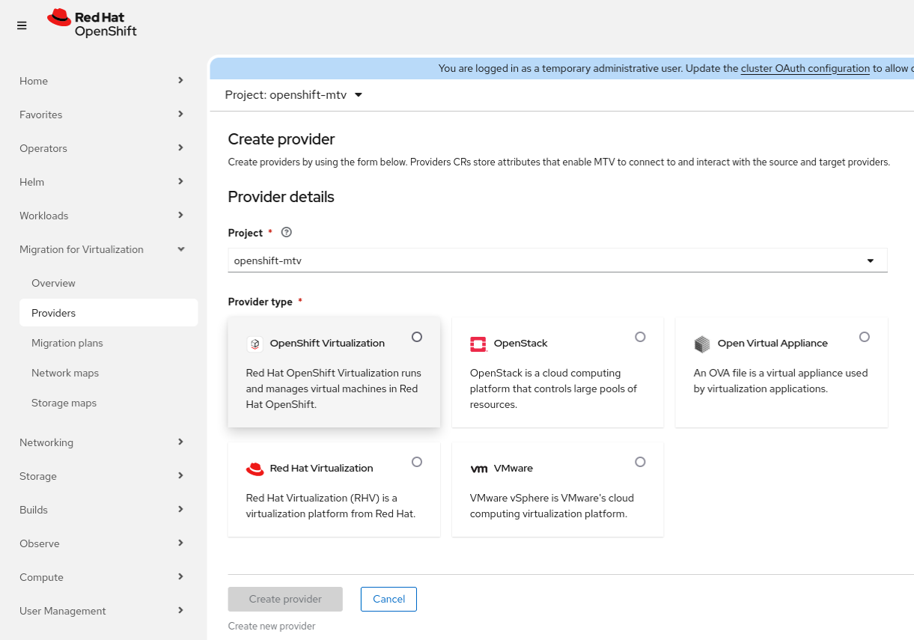
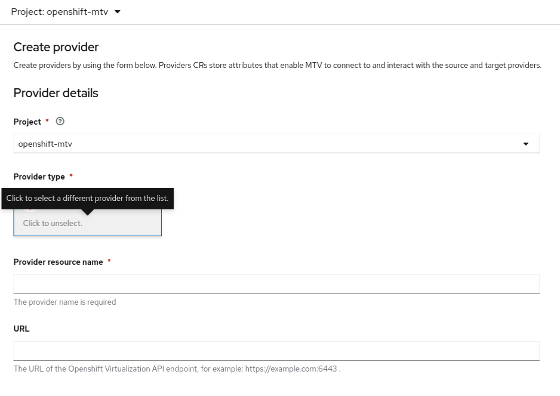
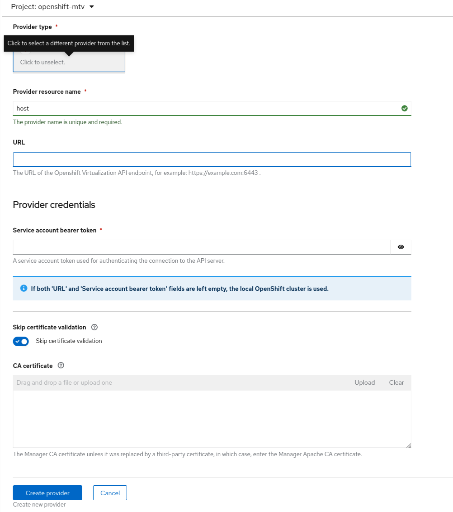

# Create an OpenShift provider for the local cluster using the console

## Configure the provider

All the steps can be carried out using the console.

**In main menu, select `Migration for Virtualization` and there the submenu `Providers`. Create a new provider.** 
**From the supported list of migration sources, select OpenShift Virtualization. Keep the project as openshift-mtv.**  

  **Once selected , immediately the window for configuring it is displayed.**   

  **Fill in the config options:**

**- keep the project name as openshift-mtv**  
**- keep the provider type as selected above - it will give the option to select another provider. This is misleading and should be not selected.**  
**- provide a name for the resource - any descriptive name is fine**  
**- DO NOT select the endpoint type - this will use the local cluster**  
**- leave the URL and the bearer token EMPTY**

  **At this point, all information should be green - this doesn't say that it's correct but only the expected format of the values is correct:**   

  **All information is filled in - hit the `Create provider` button. It takes now a few seconds only and the `Ready` sign should be there for `host` provider.**   
