# Create vSphere provider using the console

All the steps can be carried out using the console - even the creation and upload of the vddk image.

In main menu, select `Migration for Virtualization` and there the submenu `Providers`.
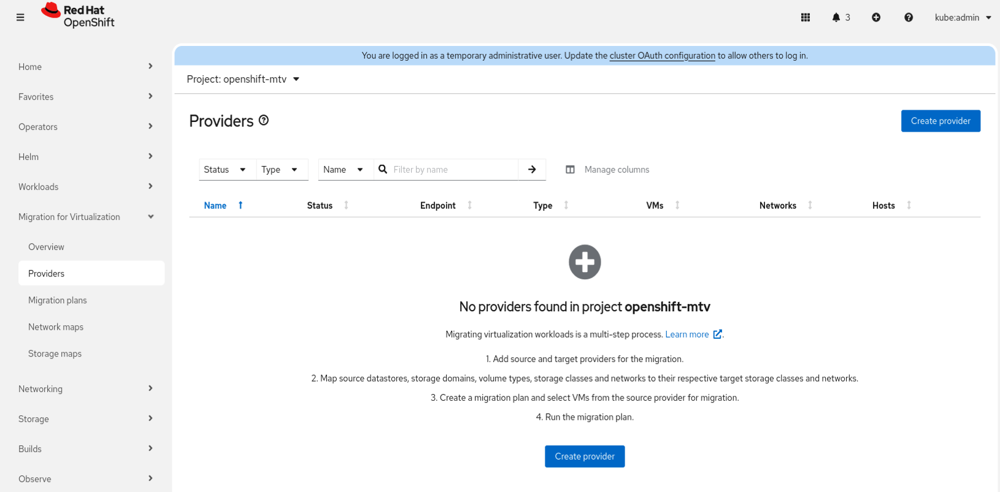

From the supported list of migration sources, select VMware. Keep the project as openshift-mtv.
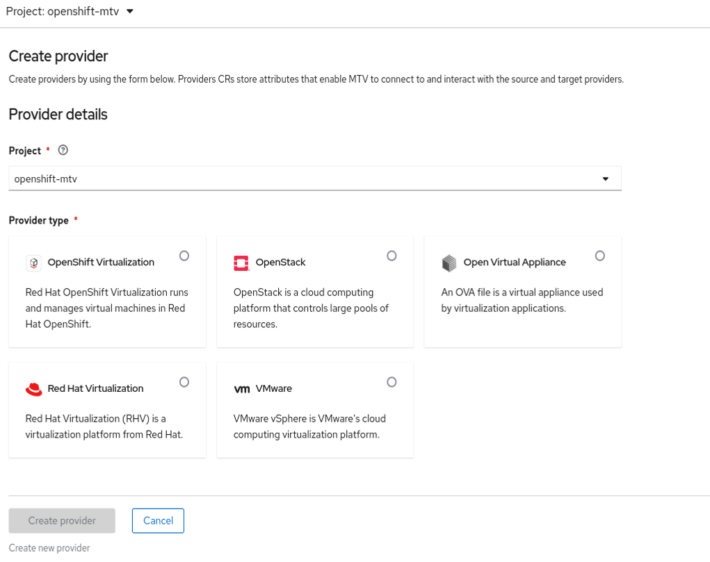

Once selected , immediately the window for configuring it is displayed.  
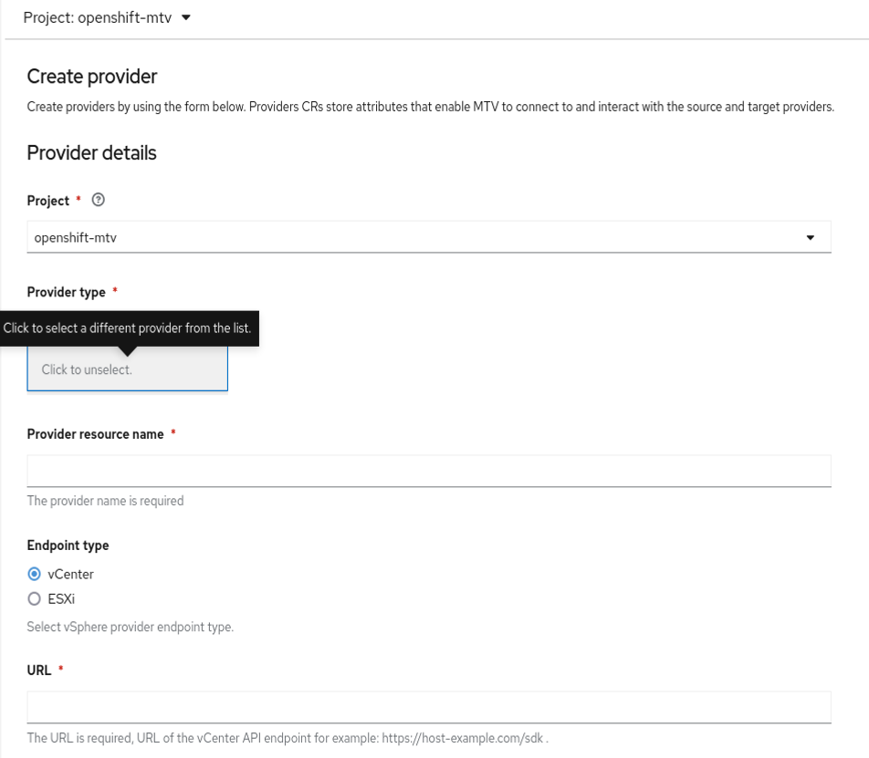

Fill in the config options:

- keep the project name as openshift-mtv
- keep the provider type as selected above - it will give the option to select another provider. This is misleading and should be not selected.
- provide a name for the resource
- select the endpoint type
- provide the URL to vCenter as in https://dns.name.of.vcenter.domain/sdk

Creating the vddk image is available here from the console:  
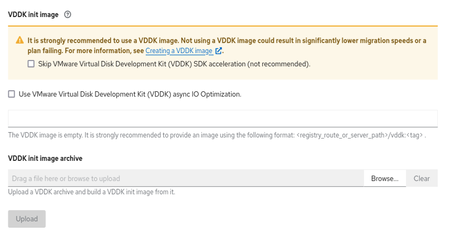

The vddk image should be downloaded from [VMware](https://developer.broadcom.com/sdks/vmware-virtual-disk-development-kit-vddk/latest).

Upload the vddk tarball: through `Browse`select the locally (your workstation) stored tarball - once you hit the `Upload` button, the image will be created automatically and stored into the local OpenShift image registry of the cluster.  
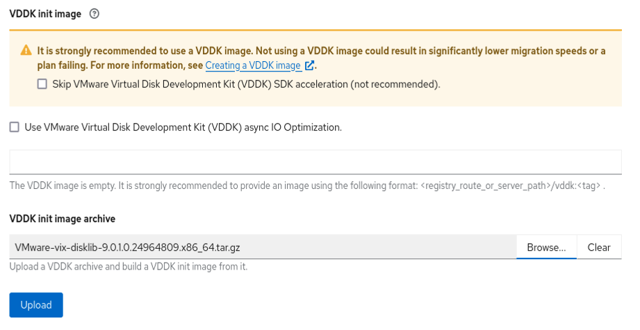

Then it takes some tens seconds to build the image:  
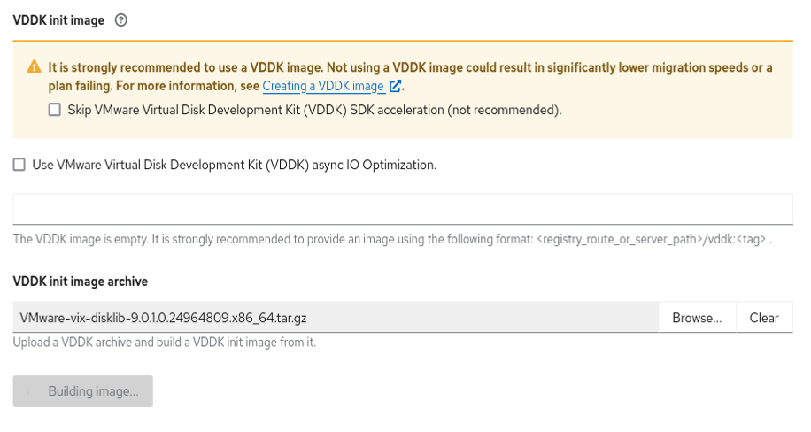

Eventually, the image location will be presented in the VDDK image field. There is no need to upload another one into a custom location.  
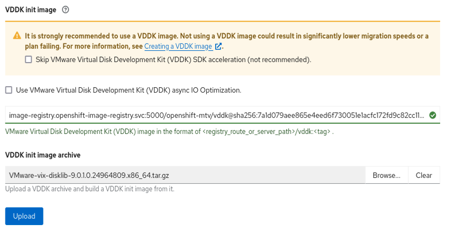

At this point, all information should be green - this doesn't say that it's correct but only the expected format of the values is correct:  
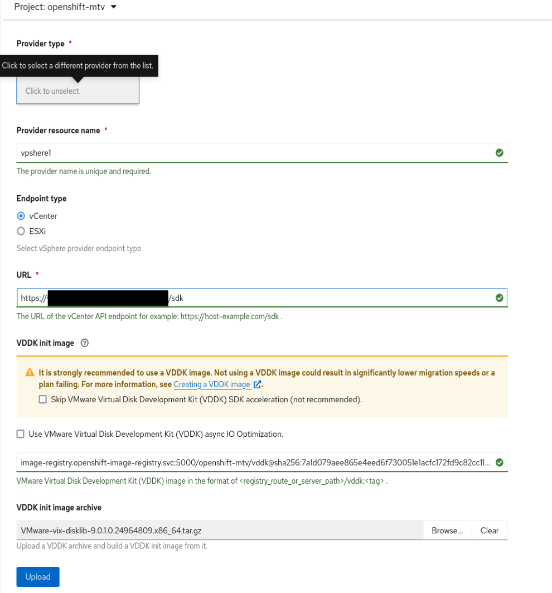

Enter your login credentials for the vCenter / ESXi host and add the certificate - alternatively, select to skip the certificate.  
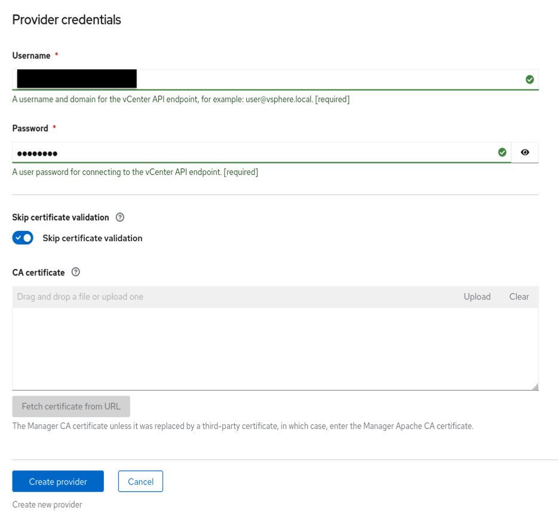

Once all information is filled in, hit the `Create provider` button. It takes now a few seconds only and the `Ready` sign should be there.  
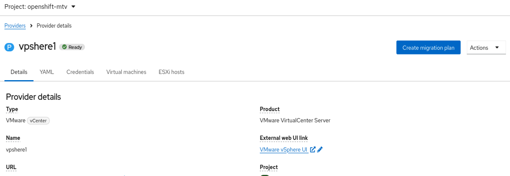

Further down in the overview for this new provider, the provider inventory should list the resources of the migration source:  
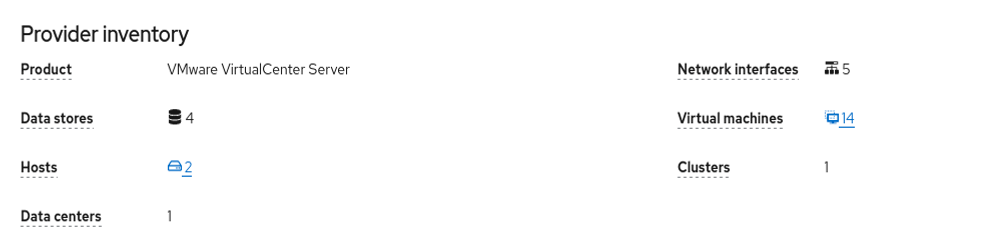

Now, on the main provider list, this new provider should be listed and should have `Ready` as the status.  
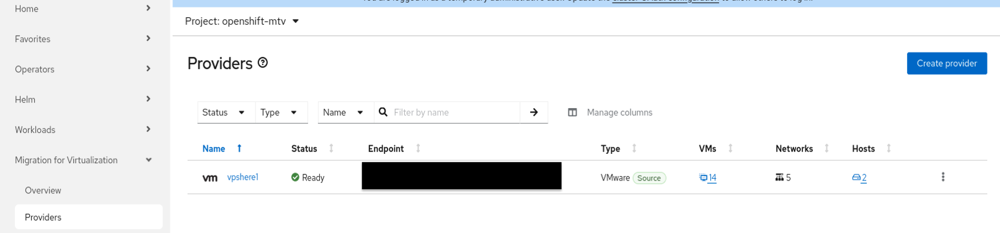
