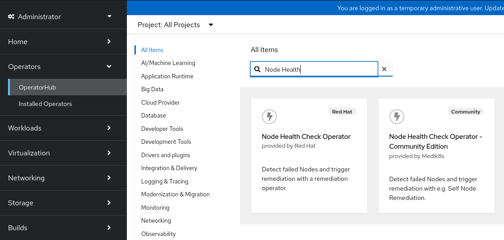
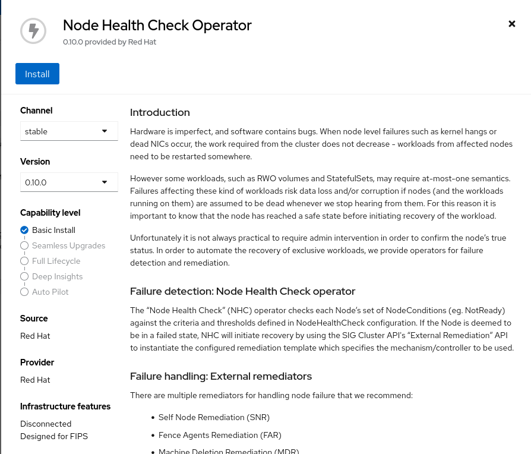
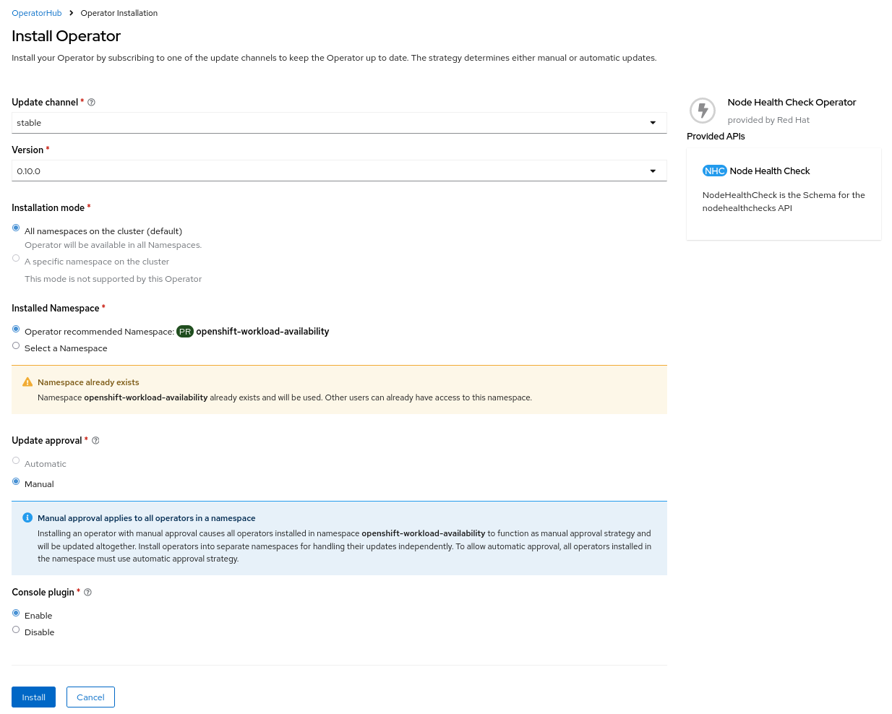
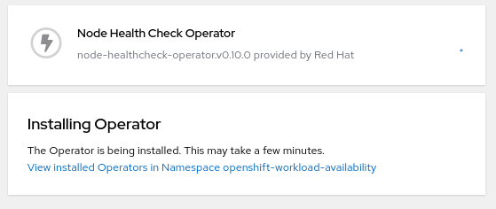
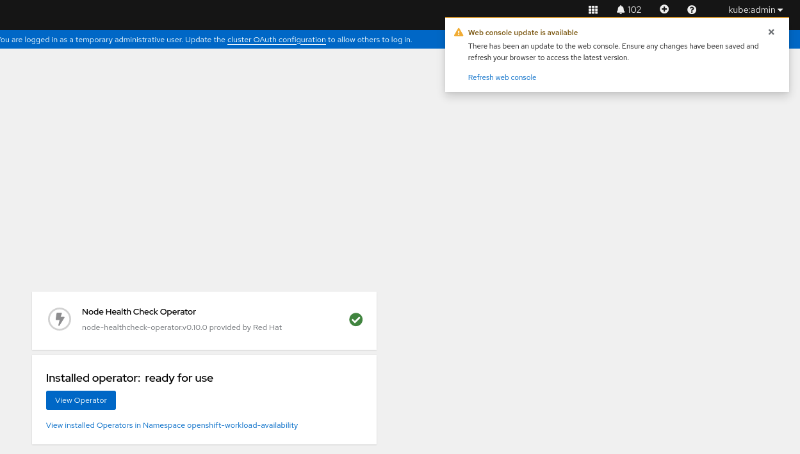
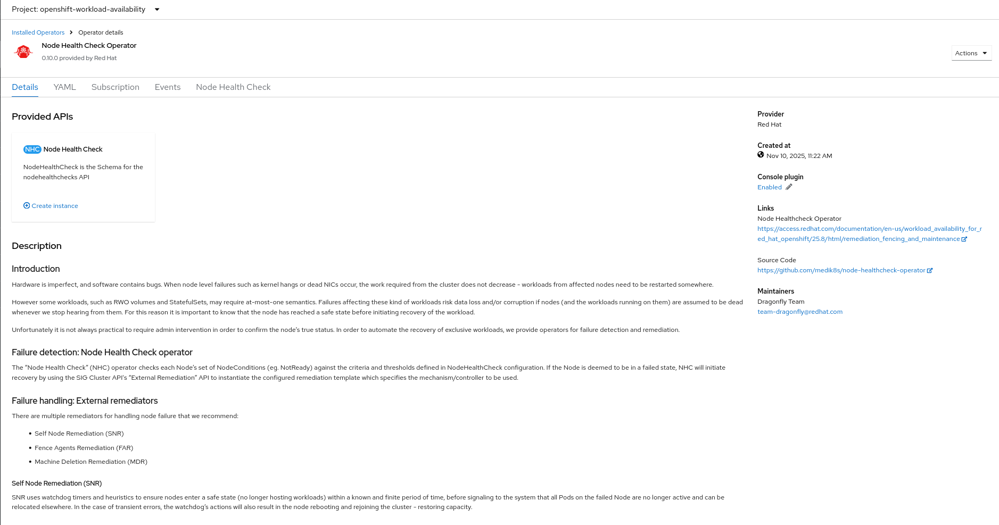

# Node Health Check operator installation and configuration using the CLI

**Important: in order to use any remediation techniques, the NHC operator must be installed.**

## Install operator from OperatorHub






**NOTE: Missing manual approval for operator installation**




A NodehealthCheck instance must be created. There is a form view available:


## Install the operator

One doesn't ned to create a new namespace since the operator goes to openshift-operators that should be there anyways.

```
!!!include(nhc-operatorgroup.yaml)!!!
```

Create the operator group.

```
oc create -f nhc-operatorgroup.yaml
```

Create a a subscription.

```
!!!include(nhc-subscription.yaml)!!!
```

```
oc create -f nhc-subscription.yaml
```

Verify the installation.

```
# Check the ClusterServiceVersion (CSV) status
oc get csv -n openshift-operators | grep node-healthcheck-operator

# Wait for the PHASE to be 'Succeeded'
# Example Output: node-healthcheck-operator.vX.Y.Z Node Health Check Operator X.Y.Z Succeeded

# Check the Operator's Deployment
oc get deploy -n openshift-operators | grep node-health-check-operator-controller-manager
# Wait for 1/1 READY
```

## Configure the NHC

!!!(nhc-configuration.yaml)!!!

Create the config

```
oc create -f my-worker-nhc.yaml
```

## Verify the configuration

```
oc get nodehealthcheck nhc-worker-default
```
